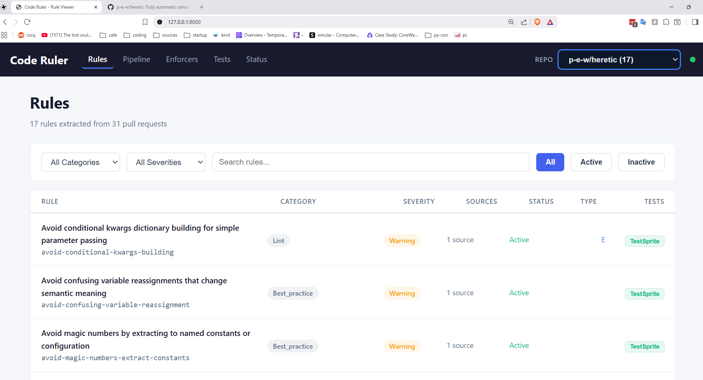
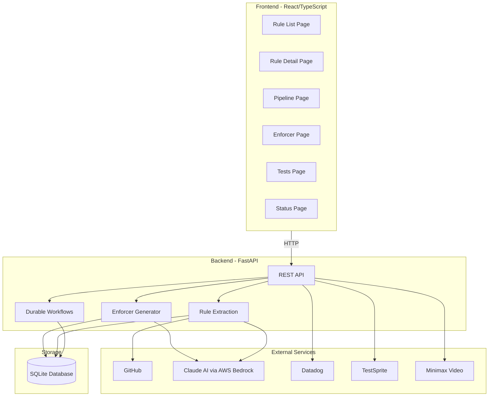
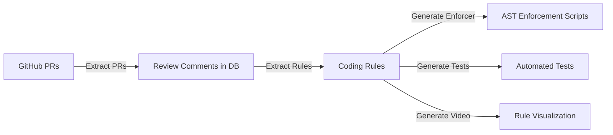
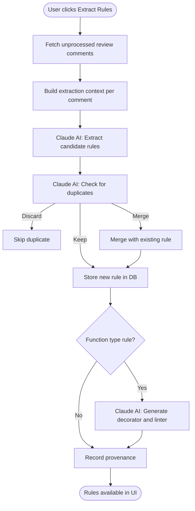
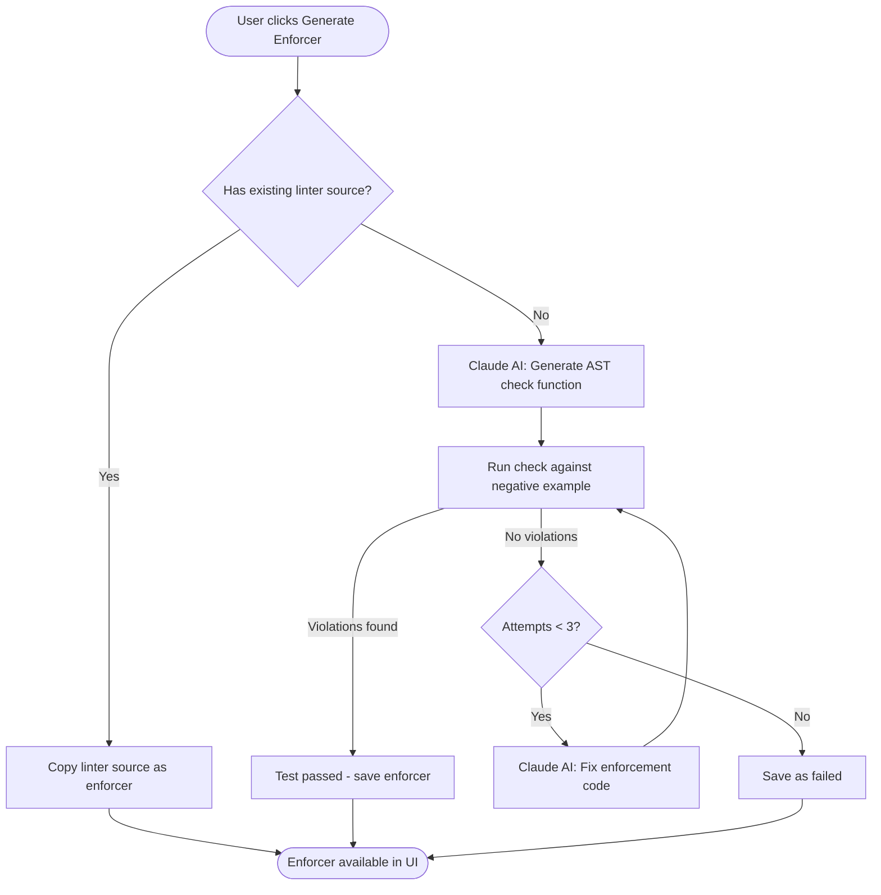
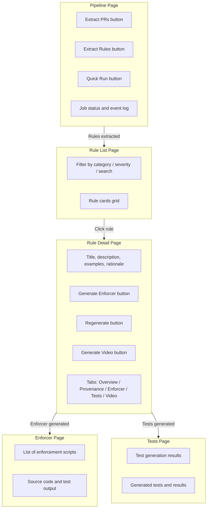
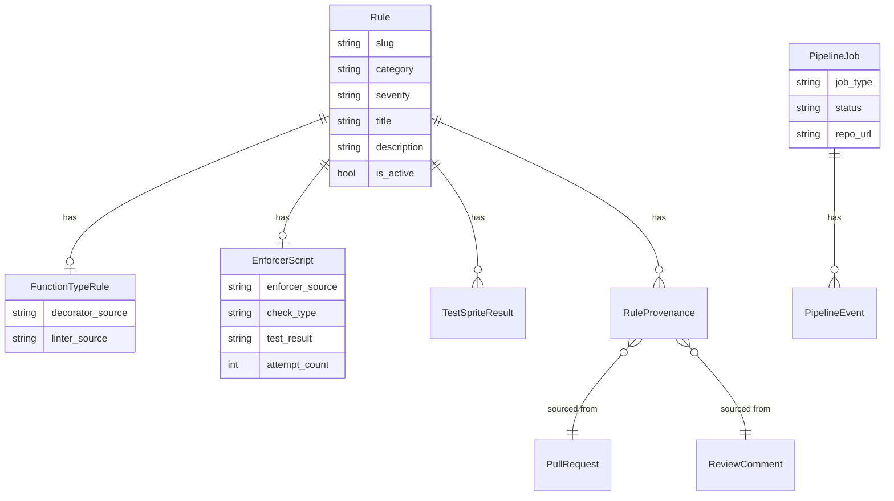

# Code Ruler

## `TO RUN, USE ./start.sh`

AI-powered system that automatically extracts coding rules from GitHub PR review comments, then generates enforcement scripts and tests for those rules.

## Prerequisites

- If on linux, you must install prerequisite packages to the OS
that are needed to build python (google command for OS).
- Install mise.

## Running

`uv run ./package_name/main.py`

## Testing

- [TestSprite Test Report](testsprite_tests/testsprite-mcp-test-report.md)
- [TestSprite Raw Report](testsprite_tests/tmp/raw_report.md)

Run tests: `uv run pytest testsprite_tests/test_all_endpoints.py -v`

## Architecture Overview

## Main User Workflow

## Rule Extraction Pipeline

## Enforcer Generation Flow

## Frontend Pages and Actions

## Data Model

